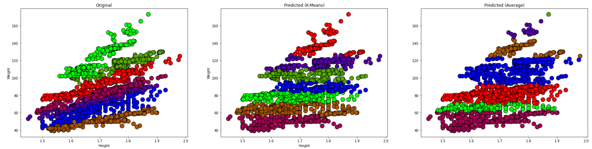

# Clustering and Association Analysis on Obesity Data

This project applies unsupervised learning techniques to analyze an obesity-related dataset using clustering and association rule mining. It focuses on identifying natural groupings within the data and discovering hidden patterns among features that may relate to obesity. The analysis compares the performance of K-Means and Average Hierarchical Clustering, with evaluation based on entropy metrics.

## Table of Contents
- [Overview](#overview)
- [Methods](#methods)
- [Evaluation](#evaluation)
- [Results and Conclusion](#results-and-conclusion)
- [Metrics Definition](#metrics-definition)
- [How to Run](#how-to-run)
- [Dependencies](#dependencies)

## Overview

The dataset, ObesityDataSet.csv, contains various features related to individual lifestyle, eating habits, and physical condition. The main objectives of this project are:

- To identify meaningful clusters in the data using unsupervised methods.
- To evaluate clustering results based on cluster purity (entropy).
- To mine association rules that can reveal relationships between contributing factors of obesity.

## Methods

### 1. Data Preprocessing
The Dataset comes from [Kaggle's Obesity Clustering Dataset](https://www.kaggle.com/code/earije/k-means-clustering-with-obesity-dataset). Data is cleaned and prepared for analysis. This includes handling missing values, encoding categorical features, and normalization where necessary.

### 2. K-Means Clustering
K-Means is used to partition the dataset into k clusters by minimizing the within-cluster sum of squares. It assumes spherical clusters and works well for compact groups.

### 3. Average Hierarchical Clustering (AHC)
AHC is an agglomerative method that begins with each data point as a single cluster and merges them step-by-step based on average linkage distance until all points form a single hierarchy.

### 4. Association Rule Mining
The Apriori algorithm is applied to generate frequent itemsets and extract rules that indicate strong relationships between features (e.g., high-calorie food consumption and obesity levels).

## Evaluation

Entropy is used as the primary evaluation metric to determine how pure the clusters are. It measures the degree of disorder or impurity in the clustering result. Lower entropy values indicate better clustering performance.

### Clustering Entropy Results:
- *K-Means Clustering*: 0.8419
- *Average Hierarchical Clustering*: 0.8794

The lower entropy value of K-Means suggests that it forms more coherent clusters compared to AHC.

## Visualization

Below is an example visualization showing the trend of bike rentals over time:



## Results and Conclusion

- *K-Means* created more compact and meaningful clusters, better capturing the patterns in the data.
- *AHC* displayed overlapping clusters and sometimes left clusters empty, which indicates a less suitable fit for this dataset.
- Based on entropy and visual cluster analysis, *K-Means is more effective* for the given obesity dataset.
- Association rules revealed correlations between lifestyle choices and obesity risk, adding interpretability to the clustering results.

## Metrics Definition

### Entropy
Entropy evaluates the purity of clusters. It is calculated using the formula:
Entropy = - I (p_i * log2(p_i))

Where p_i is the proportion of class i in a cluster. A lower entropy value means the cluster has more homogeneous members, indicating a better clustering result.

## How to Run

1. Clone this repository.
2. Open the ".ipynb" file in Jupyter Notebook or Google Colab.
3. Run all cells to reproduce the analysis and visualizations.

## Dependencies

Ensure the following Python packages are installed:

- pandas
- numpy
- matplotlib
- seaborn
- scikit-learn
- mlxtend

You can install them using:

```bash
pip install -r requirements.txt
